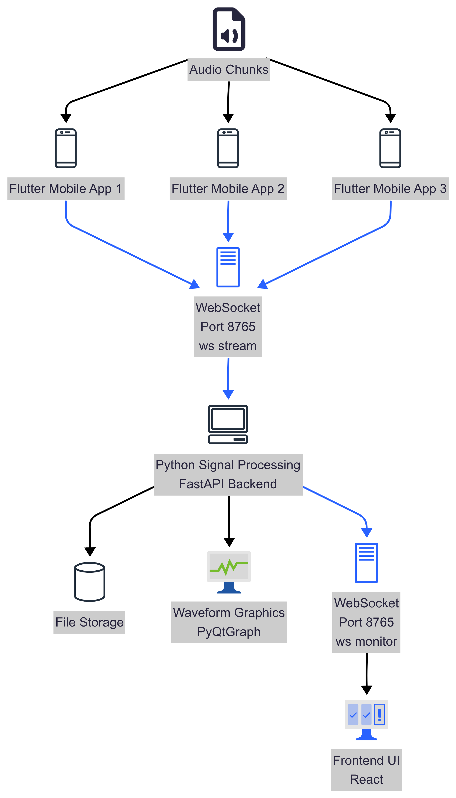

# Signal Audio Stream

A Flutter mobile application that streams real-time audio from mobile devices to a PC server over a local network using WebSocket connections.

## 📱 Overview

Signal Audio Stream is an MVP (Minimum Viable Product) application designed for real-time audio streaming from Android/iOS devices to a PC server. The app establishes a WebSocket connection with a server and streams audio data in real-time, making it perfect for remote audio monitoring, live streaming, or audio recording applications.

### System Architecture



## ✨ Features

- **Real-time Audio Streaming**: Stream audio from mobile device microphone to PC server
- **WebSocket Communication**: Reliable real-time communication with server
- **Device Management**: Multiple device support with unique device IDs
- **Heartbeat Monitoring**: Connection health monitoring with automatic reconnection
- **Delayed Streaming**: Support for delayed stream start based on server commands
- **Animated UI**: Lottie animations for recording status indication
- **Cross-platform**: Supports Android and iOS

## 🔧 Requirements

### Mobile Device Requirements
- **Android**: API level 23 (Android 6.0) or higher
- **iOS**: iOS 11.0 or higher
- **Permissions**: Microphone access required

### Development Environment
- **Flutter SDK**: 3.8.1 or higher
- **Dart SDK**: Included with Flutter
- **Android Studio**: For Android development
- **Xcode**: For iOS development (macOS only)

### Server Requirements
- WebSocket server running on port 8765
- Server should handle the following message types:
  - `connection_request` / `connection_ack`
  - `heartbeat` / `heartbeat_ack`
  - `start_stream` / `end_stream`
  - `stream_ended`

## 📦 Dependencies

```yaml
dependencies:
  flutter: sdk: flutter
  record: ^6.0.0              # Audio recording
  audioplayers: ^5.2.1        # Audio playback utilities
  path_provider: ^2.1.2       # File system access
  path: ^1.8.3                # Path manipulation
  web_socket_channel: ^3.0.3  # WebSocket communication
  lottie: ^2.7.0              # Animated graphics
  cupertino_icons: ^1.0.8     # iOS-style icons
```

## � Installation

### 1. Clone the Repository
```bash
git clone https://github.com/itu-itis22-dalci22/signalstream.git
cd signalstream
```

### 2. Install Dependencies
```bash
flutter pub get
```

### 3. Configure Android (if targeting Android)

#### Update Android Settings
The app is configured for:
- **Minimum SDK**: API 23 (Android 6.0)
- **Target SDK**: Latest available
- **Compile SDK**: Latest available

#### Add Permissions
The app requires microphone permissions, which are already configured in:
- `android/app/src/main/AndroidManifest.xml`

### 4. Configure iOS (if targeting iOS)

#### Update iOS Settings
- **Minimum iOS Version**: 11.0
- **Microphone Permission**: Required

Add microphone usage description in `ios/Runner/Info.plist`:
```xml
<key>NSMicrophoneUsageDescription</key>
<string>This app needs access to microphone to stream audio</string>
```

## 🏃‍♂️ Running the App

### Debug Mode
```bash
# Run on connected device/emulator
flutter run

# Run on specific device
flutter devices
flutter run -d <device_id>

# Hot reload enabled for development
```

### Release Mode
```bash
# Run in release mode
flutter run --release
```

## 📱 Building APK/IPA

### Android APK

#### Debug APK
```bash
flutter build apk --debug
```
Output: `build/app/outputs/flutter-apk/app-debug.apk`

#### Release APK
```bash
flutter build apk --release
```
Output: `build/app/outputs/flutter-apk/app-release.apk`

#### Split APKs by Architecture (Smaller file sizes)
```bash
flutter build apk --split-per-abi --release
```
Output: 
- `build/app/outputs/flutter-apk/app-arm64-v8a-release.apk`
- `build/app/outputs/flutter-apk/app-armeabi-v7a-release.apk`
- `build/app/outputs/flutter-apk/app-x86_64-release.apk`

### Android App Bundle (AAB) - Recommended for Play Store
```bash
flutter build appbundle --release
```
Output: `build/app/outputs/bundle/release/app-release.aab`

### iOS IPA (macOS only)
```bash
flutter build ios --release
```
Then use Xcode to archive and export the IPA file.

## 🔐 Release Signing

### Android Release Signing

For production releases, you need to sign the APK:

1. **Create a keystore**:
```bash
keytool -genkey -v -keystore ~/upload-keystore.jks -keyalg RSA -keysize 2048 -validity 10000 -alias upload
```

2. **Create `android/key.properties`**:
```properties
storePassword=<password_from_previous_step>
keyPassword=<password_from_previous_step>
keyAlias=upload
storeFile=<location_of_the_key_store_file>
```

3. **Update `android/app/build.gradle.kts`** to use the signing configuration.

### iOS Release Signing

Use Xcode to configure signing certificates and provisioning profiles for iOS releases.

## 📋 Usage

### 1. Setup Server Connection
- Enter your PC's IP address
- Specify a unique Device ID
- Tap "Connect to Server"

### 2. Start Streaming
- Once connected, tap "Start Stream"
- The app will begin streaming audio to the server
- Recording animation will indicate active streaming

### 3. Control Streaming
- Use "Pause" to stop streaming
- Use "Disconnect from Server" to close connection

### Server Message Protocol

The app responds to these WebSocket messages:

```json
{
  "msg_type": "start_stream",
  "device_ids": ["device1", "device2"],
  "start_after_ms": 1000
}
```

```json
{
  "msg_type": "end_stream",
  "device_ids": ["device1", "device2"]
}
```

## 🐛 Troubleshooting

### Common Issues

1. **Connection Failed**
   - Verify server IP address and port
   - Ensure devices are on the same network
   - Check firewall settings

2. **Microphone Permission Denied**
   - Grant microphone permission in device settings
   - Restart the app after granting permission

3. **Audio Not Streaming**
   - Check server logs for connection status
   - Verify WebSocket server is handling audio data
   - Ensure device ID matches server expectations

### Debug Commands

```bash
# Check connected devices
flutter devices

# View logs
flutter logs

# Clear build cache
flutter clean
flutter pub get
```

## 🛠️ Development

### Project Structure
```
lib/
├── main.dart           # Main application entry point
└── stream-audio.dart   # Audio streaming functionality

android/                # Android-specific files
ios/                   # iOS-specific files
assets/
└── animations/
    └── record.json    # Lottie animation for recording indicator
```

### Key Components

- **HomeScreen**: Main UI with connection and streaming controls
- **AudioSession**: Manages audio recording session
- **WebSocket Handler**: Manages real-time communication with server

## 📄 License

This project is developed as an MVP for educational/research purposes. Please check with the repository owner for license details.

## 📞 Support

For issues and questions:
- Create an issue on the GitHub repository
- Check existing documentation and troubleshooting guide

## 🔄 Version History

- **1.0.0+1**: Initial MVP release with basic audio streaming functionality

---

**Note**: This is an MVP application. For production use, consider implementing additional security measures, error handling, and performance optimizations.
